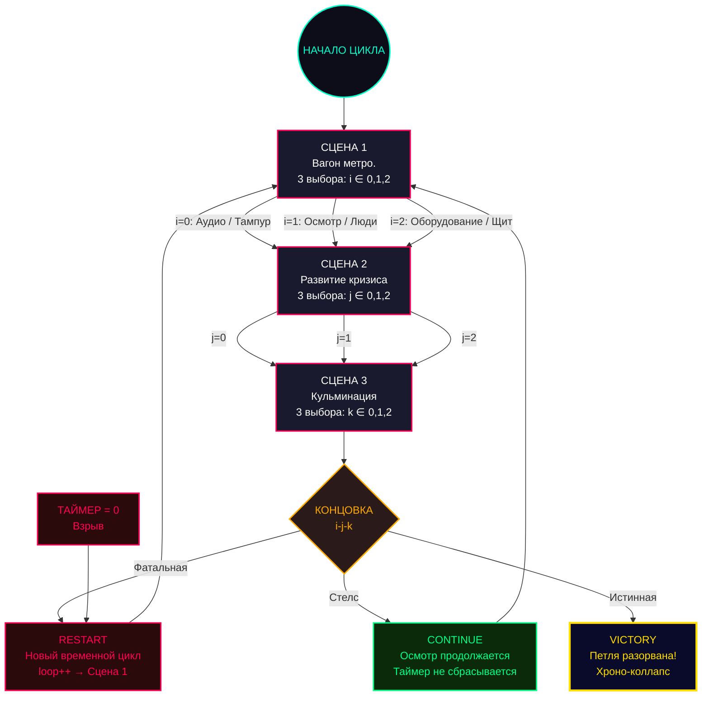

# Хроно-Метро: Петля Энтропии — Карта взаимодействий

> Интерактивная документация по структуре игры, дереву выборов, системе воспоминаний
> и архитектуре модулей. Все диаграммы Mermaid совместимы с GitHub и VSCode.

---

## 1. Общая блок-схема потока



### Условие истинной концовки (путь 2-2-2)

```mermaid
flowchart LR
    subgraph УЛИКИ — все 7 обязательны
        B[bomb_found]
        T[terrorist_know]
        G[generator_key]
        BR[brake_broken]
        C[cabin_code]
        S[soldier_trust]
        Y[yellow_wire]
    end

    ALL{"Все 7 собраны?"} -->|Да| WIN["ИСТИННЫЙ РАССВЕТ<br/>Петля разорвана"]
    ALL -->|Нет| FAIL["Провал<br/>Подсказка о недостающей улике"]

    B & T & G & BR & C & S & Y --> ALL

    style WIN fill:#0a0a2a,stroke:#ffdd00,stroke-width:3px,color:#ffdd00
    style FAIL fill:#2a0a0a,stroke:#ff0055,stroke-width:2px,color:#ff0055
```

---

## 2. Дерево выборов — все 27 путей

### Ветки Сцены 1

```mermaid
flowchart LR
    subgraph i=0 Ветка A — Тампур
        direction TB
        A0["j=0: Паника → Бежать к двери"]
        A1["j=1: Пол → Упасть / Застыть"]
        A2["j=2: Писк → Ползти к бомбе"]
    end
    subgraph i=1 Ветка B — Люди
        direction TB
        B0["j=0: Бизнесмен → Напасть / Обвинить"]
        B1["j=1: Девушка → Подойти"]
        B2["j=2: Стоп-кран → Дернуть"]
    end
    subgraph i=2 Ветка C — Оборудование
        direction TB
        C0["j=0: Переговорное → Колошматить / Щит"]
        C1["j=1: Люк → Открыть / Осмотреть"]
        C2["j=2: Кабина → Подойти"]
    end
```

### Полная таблица 27 концовок

> Базовые варианты (без собранных воспоминаний). При наличии улик тексты сцен и концовок меняются.

| # | Путь | i | j | k | Название концовки | Тип | Разблокирует улику |
|---|------|---|---|---|-------------------|-----|-------------------|
| 1 | 0-0-0 | Аудио | Паника → Дверь | Толпа → Протиснуться | Давка во тьме | Фатальная | — |
| 2 | 0-0-1 | Аудио | Паника → Дверь | Толпа → Выбить стекло | Холодная сцепка | Фатальная | — |
| 3 | 0-0-2 | Аудио | Паника → Дверь | Толпа → Сдаться | Огненный шквал | Фатальная | — |
| 4 | 0-1-0 | Аудио | Пол → Застыть | Пол → Наушники | Пепел и музыка | Фатальная | — |
| 5 | 0-1-1 | Аудио | Пол → Застыть | Пол → Проползти к писк | Слепая жертва | Фатальная | **bomb_found** |
| 6 | 0-1-2 | Аудио | Пол → Застыть | Пол → Найти рюкзак | Осколки стекла | Фатальная | **bomb_found** |
| 7 | 0-2-0 | Аудио | Писк → Бомба | Бомба → Синий провод | Ошибка сапёра | Фатальная | — |
| 8 | 0-2-1 | Аудио | Писк → Бомба | Бомба → Красный провод | Красный пульс | Фатальная | — |
| 9 | 0-2-2 | Аудио | Писк → Бомба | Бомба → Жёлтый провод | Жёлтая нить / Парусина и огонь | Фатальная | **yellow_wire** (условно)* |
| 10 | 1-0-0 | Осмотр | Бизнесмен | Кейс → Вырвать | Неуместная милота | Фатальная | — |
| 11 | 1-0-1 | Осмотр | Бизнесмен | Кейс → Заорать | Дипломат раздора | Фатальная | — |
| 12 | 1-0-2 | Осмотр | Бизнесмен | Отойти и осмотреться | Взгляд в углу | Фатальная | **terrorist_know** |
| 13 | 1-1-0 | Осмотр | Девушка | Сумочка → Выхватить | Гнев толпы | Фатальная | — |
| 14 | 1-1-1 | Осмотр | Девушка | Предложить помощь | Акт доверия | **Стелс** | — |
| 15 | 1-1-2 | Осмотр | Девушка | Заглянуть в сумочку | Тихое наблюдение | **Стелс** | — |
| 16 | 1-2-0 | Осмотр | Стоп-кран | Кран → Сильнее | Сорванный тормоз | Фатальная | **terrorist_know**, **brake_broken** (только без terrorist_know)** |
| 17 | 1-2-1 | Осмотр | Стоп-кран | Попросить помощи у военного | Потерянное время | Фатальная | **soldier_trust** (только без terrorist_know) |
| 18 | 1-2-2 | Осмотр | Стоп-кран | Позвать военного | Бесполезный поиск / Совместный захват | Фатальная | **soldier_trust** (только с terrorist_know) |
| 19 | 2-0-0 | Щит | Устройство | Сунуть руку / Кабель | Удар током (825В) | Фатальная | — |
| 20 | 2-0-1 | Щит | Устройство | Прислушаться / Маркировки | Тихий перехват | **Стелс** | **cabin_code** |
| 21 | 2-0-2 | Щит | Устройство | Заорать в микрофон / Рубильник | Крик в пустоту | Фатальная | — |
| 22 | 2-1-0 | Щит | Люк | Голыми руками → Ключ / Осмотреть | Тихий поиск: ключ | **Стелс** | **generator_key** |
| 23 | 2-1-1 | Щит | Люк | Вытащить ключ монтёра / Проверить шланги | Тихий поиск: кража | **Стелс** | **generator_key** |
| 24 | 2-1-2 | Щит | Люк | Зажать шланг руками (с ключом) / Продолжать дёргать (без) | Воздушный сдвиг / Сорванные пальцы | Фатальная | **brake_broken*** |
| 25 | 2-2-0 | Щит | Кабина | Осмотреть замок | Запертая кабина | **Стелс** | — |
| 26 | 2-2-1 | Щит | Кабина | Огнетушитель → Дверь | Призрак у руля | Фатальная | **cabin_code** |
| 27 | 2-2-2 | Щит | Кабина | Подобрать код на цифровой панели | ИСТИННЫЙ РАССВЕТ (или провал) | Истинная / Фатальная | — |

> **\*** Путь 9 (`0-2-2`) разблокирует `yellow_wire` только при выполнении одного из двух условий: уже собрана `soldier_trust` ИЛИ террорист нейтрализован в текущей сессии (стелс через `1-1-1` / `1-1-2`). Без союзника срабатывает концовка «Парусина и огонь» — террорист взрывает заряд дистанционно, улика не записывается.
>
> **\*\*** Путь 16 (`1-2-0`) разблокирует `brake_broken` только при `terrorist_know=false`. С `terrorist_know` тройка означает «прыжок на террориста» (концовка «Прямая атака»), и стоп-кран в этой сцене не задействован.
>
> **\*\*\*** Путь 24 (`2-1-2`) разблокирует `brake_broken` только при наличии `generator_key`. Без ключа — концовка «Сорванные пальцы», улика не выдаётся.

### Статистика

| Тип | Количество | Кнопка |
|-----|-----------|--------|
| Фатальная (RESTART) | 19 | Красная |
| Стелс (CONTINUE) | 7 | Зелёная |
| Истинная (VICTORY) | 1 (2-2-2 + все улики) | Золотая |

---

## 3. Карта влияния воспоминаний

```mermaid
graph TD
    subgraph УЛИКИ
        BF["bomb_found<br/>СВУ под сиденьем №4"]
        TK["terrorist_know<br/>Личность террориста"]
        GK["generator_key<br/>Трёхгранный ключ"]
        YW["yellow_wire<br/>Жёлтый провод"]
        BB["brake_broken<br/>Саботаж тормозов"]
        ST["soldier_trust<br/>Доверие Алексея"]
        CC["cabin_code<br/>Код кабины (3 цифры)"]
    end

    subgraph ВЕТКА_A["Ветка A (i=0)"]
        A_S1["Сцена 1: текст + выборы"]
        A_S2["Сцена 2: текст + выборы"]
        A_S3["Сцена 3: текст + выборы"]
        A_END["Концовки 1–9"]
    end

    subgraph ВЕТКА_B["Ветка B (i=1)"]
        B_S1["Сцена 1: текст + выборы"]
        B_S2["Сцена 2: текст + выборы"]
        B_S3["Сцена 3: текст + выборы"]
        B_END["Концовки 10–18"]
    end

    subgraph ВЕТКА_C["Ветка C (i=2)"]
        C_S1["Сцена 1: текст + выборы"]
        C_S2["Сцена 2: текст + выборы"]
        C_S3["Сцена 3: текст + выборы"]
        C_END["Концовки 19–27"]
    end

    TRUE_FIN["ИСТИННЫЙ РАССВЕТ<br/>(2-2-2 + все 7 улик)"]

    BF -->|"Влияет на"| A_S1
    BF -->|"Влияет на"| A_S2
    BF -->|"Влияет на"| A_S3
    BF -->|"Влияет на"| A_END
    BF -->|"Обязательна для"| TRUE_FIN

    TK -->|"Влияет на"| B_S1
    TK -->|"Влияет на"| B_S2
    TK -->|"Влияет на"| B_S3
    TK -->|"Влияет на"| B_END
    TK -->|"Обязательна для"| TRUE_FIN

    GK -->|"Влияет на"| C_S1
    GK -->|"Влияет на"| C_S2
    GK -->|"Влияет на"| C_S3
    GK -->|"Влияет на"| C_END
    GK -->|"Обязательна для"| TRUE_FIN
    GK -->|"Условие для 2-1-2"| BB

    YW -->|"Обязательна для"| TRUE_FIN
    BB -->|"Обязательна для"| TRUE_FIN
    ST -->|"Обязательна для"| TRUE_FIN
    CC -->|"Обязательна для"| TRUE_FIN

    style TRUE_FIN fill:#0a0a2a,stroke:#ffdd00,stroke-width:3px,color:#ffdd00
    style BF fill:#2a0a0a,stroke:#ff5555,stroke-width:2px,color:#ff5555
    style TK fill:#2a0a0a,stroke:#ff5555,stroke-width:2px,color:#ff5555
    style GK fill:#2a0a0a,stroke:#ff5555,stroke-width:2px,color:#ff5555
    style YW fill:#2a2a0a,stroke:#ffdd00,stroke-width:2px,color:#ffdd00
    style BB fill:#2a0a0a,stroke:#ff5555,stroke-width:2px,color:#ff5555
    style ST fill:#0a0a2a,stroke:#00aaff,stroke-width:2px,color:#00aaff
    style CC fill:#0a2a0a,stroke:#00ff88,stroke-width:2px,color:#00ff88
```



### Детализация влияния по сценам

| Улика | Сцена 1 | Сцена 2 | Сцена 3 | Концовки |
|-------|---------|---------|---------|----------|
| `bomb_found` | +Хроно-резонанс; замена выбора i=0 | Новый текст i=0; новые выборы j | Новый текст i=0, j=0/1/2 | 8 заменённых текстов (vA: 0-0-0…0-1-2 + 0-2-0, 0-2-1) |
| `terrorist_know` | +Хроно-резонанс; замена выбора i=1 | Новый текст i=1; новые выборы j | Новый текст i=1, j=0/1/2 | 9 заменённых текстов (vB) |
| `generator_key` | +Хроно-резонанс; замена выбора i=2 | Новый текст i=2; новые выборы j | Новый текст i=2, j=0/1 | 5 заменённых текстов (vC) + доступ к brake_broken на 2-1-2 |
| `yellow_wire` | +Хроно-резонанс | — | — | Обязательна для 2-2-2 финала |
| `brake_broken` | +Хроно-резонанс | — | — | Обязательна для 2-2-2 финала |
| `soldier_trust` | +Хроно-резонанс | — | Замена k=2 в `1-2-2` (фраза «Алексей, ССО, помоги!») | Развилка концовок 0-2-2 и 1-2-2; обязательна для 2-2-2 финала |
| `cabin_code` | +Хроно-резонанс | — | — | Обязательна для 2-2-2 финала |

---

## 4. Таблица разблокировок улик

| # | Улика | Ключевой объект | Путь(и) разблокировки | Условие |
|---|-------|----------------|----------------------|---------|
| 1 | `bomb_found` | Красный рюкзак (СВУ) | **0-1-1**, **0-1-2** | Безусловная |
| 2 | `terrorist_know` | Парень в капюшоне | **1-0-2**, **1-2-0** | Безусловная |
| 3 | `generator_key` | Трёхгранный ключ монтёра | **2-1-0**, **2-1-1** | Безусловная |
| 4 | `brake_broken` | Перебитый тормозной шланг | **1-2-0** — только без `terrorist_know` | — |
| | | | **2-1-2** — только с `generator_key` | Требует улику №3 |
| 5 | `cabin_code` | Уязвимость кодовой панели | **2-0-1**, **2-2-1** | Безусловная |
| 6 | `soldier_trust` | Имя Алексея (майор ССО) | **1-2-1** — только без `terrorist_know` | — |
| | | | **1-2-2** — только с `terrorist_know` | Требует улику №2 |
| 7 | `yellow_wire` | Жёлтый провод бомбы | **0-2-2** — нужен `soldier_trust` ИЛИ `terroristNeutralized` (стелс в сессии) | Требует союзника |

```mermaid
graph LR
    subgraph Порядок сбора — минимальные зависимости
        L1["Loop 1: 0-1-1 → bomb_found"]
        L2["Loop 2: 1-0-2 → terrorist_know"]
        L3["Loop 3: 2-1-0 → generator_key"]
        L4["Loop 4: 2-1-2 → brake_broken (нужен generator_key)"]
        L5["Loop 5: 2-0-1 → cabin_code"]
        L6["Loop 6: 1-2-2 → soldier_trust (нужен terrorist_know)"]
        L7["Loop 7: 0-2-2 → yellow_wire (нужен soldier_trust)"]
        LF["Loop 8: 2-2-2 → ИСТИННЫЙ РАССВЕТ"]
    end

    L1 --> L2 --> L3 --> L4 --> L5 --> L6 --> L7 --> LF

    L3 -.->|"Ключ нужен для 2-1-2"| L4
    L2 -.->|"Без terrorist_know нет 1-2-2"| L6
    L6 -.->|"Без soldier_trust нет yellow_wire"| L7

    style LF fill:#0a0a2a,stroke:#ffdd00,stroke-width:3px,color:#ffdd00
```

---

## 5. Оптимальный порядок сбора улик

Минимальное количество циклов для получения истинной концовки — **8 циклов** (7 на сбор + 1 финальный). По коду улика `soldier_trust` устанавливается в первый же удачный проход `1-2-2 + terrorist_know`, поэтому отдельный «цикл узнавания имени» не нужен.

| Цикл | Путь | Цель | Выбор Сцена 1 | Выбор Сцена 2 | Выбор Сцена 3 | Результат |
|------|------|------|---------------|---------------|---------------|-----------|
| 1 | **0-1-1** | `bomb_found` | Аудио (i=0) | Пол → Застыть (j=1) | Проползти к писку (k=1) | Слепая жертва. Обнаружен красный рюкзак |
| 2 | **1-0-2** | `terrorist_know` | Осмотр (i=1) | Бизнесмен (j=0) | Отойти, осмотреться (k=2) | Взгляд в углу. Обнаружен парень в капюшоне |
| 3 | **2-1-0** | `generator_key` | Переговорное (i=2) | Открыть люк руками (j=1) | Голыми руками → ключ у монтёра (k=0) | Стелс. Получен трёхгранный ключ |
| 4 | **2-1-2** | `brake_broken` | Щит (i=2, replaced) | Спуститься в люк (j=1) | Зажать шланг руками (k=2) | Воздушный сдвиг. Саботаж тормозов обнаружен |
| 5 | **2-0-1** | `cabin_code` | Щит (i=2, replaced) | Силовой кабель (j=0) | Изучить маркировки (k=1) | Стелс. Уязвимость кодовой панели |
| 6 | **1-2-2** | `soldier_trust` | Сблизиться с террористом (i=1, replaced) | Нейтрализовать (j=2) | Попросить помощи у военного (k=2) | Запоздалая реакция. Имя Алексея + доверие записаны одной уликой |
| 7 | **0-2-2** | `yellow_wire` | Нырнуть под сиденье (i=0, replaced) | Вскрыть рюкзак (j=2) | Жёлтый провод (k=2) | Жёлтая нить. Алексей сдерживает террориста, провод обезврежен |
| 8 | **2-2-2** | **ПОБЕДА** | Щит (i=2, replaced) | Подойти к кабине (j=2) | Подобрать код (k=2) | Минимутка с кодом → **ИСТИННЫЙ РАССВЕТ** |

### Альтернативный путь к `brake_broken`

Без `generator_key` доступен путь **1-2-0** (Сорванный тормоз) с базовой веткой осмотра — он одновременно открывает `terrorist_know` и `brake_broken`. Но как только `terrorist_know` собрана, путь 1-2-0 превращается в «прыжок на террориста» (концовка «Прямая атака») и `brake_broken` через него уже не выдаётся.

### Альтернативный путь к `cabin_code`

Путь **2-2-1** (Призрак у руля) тоже даёт `cabin_code`, но фатален и требует прорыва в кабину с огнетушителем. Стелс через **2-0-1** надёжнее.

### Альтернативный путь к `yellow_wire`

Если в текущей сессии стелсом нейтрализован террорист (путь **1-1-1** или **1-1-2** при `terrorist_know`), то на CONTINUE сразу же можно идти на `0-2-2` — улика выдастся даже без `soldier_trust`. Это позволяет совместить два цикла в один.

---

## 6. Архитектура модулей

```mermaid
graph TD
    HTML["index.html"]
    CSS["css/styles.css"]
    GAME["js/game.js<br/>(type=module)"]
    AUDIO["js/audio.js"]
    DATA["js/text-data.js"]

    HTML -->|"&lt;link&gt;"| CSS
    HTML -->|"&lt;script type=module&gt;"| GAME
    GAME -->|"import { ChronoAudio }"| AUDIO
    GAME -->|"import { getSceneText,<br/>getAvailableChoices,<br/>getScene3Text,<br/>getScene3Choices,<br/>getEndingText,<br/>getZoneAnalysis,<br/>isFatalEnding,<br/>MEMORY_META,<br/>DEFAULT_MEMORIES }"| DATA

    subgraph game.js — Класс ChronoMetro
        INIT["init()"]
        LOOP["startLoop()"]
        RENDER["renderScene()"]
        CHOICE["handleChoice()"]
        ENDING["showEnding()"]
        ZONE["analyzeZone()"]
        UNLOCK["unlockMemory()"]
        CHECK["checkUnlocks()"]
        SAVE["saveProgress()"]
        LOAD["loadProgress()"]
        ARCHIVE["renderArchive()"]
        TIMER["updateTimerDisplay()"]
        TEST["runAllPathsTest()"]
    end

    subgraph audio.js — Класс ChronoAudio
        AINIT["init()"]
        RUMBLE["startTrainRumble()"]
        CLICK["playTextClick()"]
        GLITCH["playGlitch()"]
        EXPLOSION["playExplosion()"]
        BEEP["playTimerBeep()"]
    end

    RENDER --> CLICK
    RENDER --> GLITCH
    ENDING --> EXPLOSION
    ENDING --> GLITCH
    UNLOCK --> GLITCH
    ZONE --> GLITCH
    TIMER --> BEEP
    INIT --> AINIT
    INIT --> RUMBLE

    style HTML fill:#1a1a2e,stroke:#00aaff,stroke-width:2px,color:#fff
    style CSS fill:#1a2a1a,stroke:#00ff88,stroke-width:2px,color:#fff
    style GAME fill:#2a1a2a,stroke:#ff55ff,stroke-width:2px,color:#fff
    style AUDIO fill:#2a2a1a,stroke:#ffaa00,stroke-width:2px,color:#fff
    style DATA fill:#1a2a2a,stroke:#00ffcc,stroke-width:2px,color:#fff
```

### Структура файлов

```
Antigravity/
├── index.html              Точка входа, SVG-план вагона, UI-разметка
├── css/
│   └── styles.css          Стили, CSS-переменные, анимации глитча
├── js/
│   ├── game.js             Главный контроллер (ChronoMetro)
│   ├── text-data.js        Контент: тексты сцен, выборы, концовки, улики
│   └── audio.js            Web Audio API синтезатор (ChronoAudio)
└── docs/
    └── narrative-map.md    Данный документ
```

---

## 7. Перекрёстные ссылки методов

### game.js → text-data.js

| Метод game.js | Делегирует к | Функция text-data.js | Параметры | Описание |
|---------------|-------------|---------------------|-----------|----------|
| `_getSceneText()` | `renderScene()` | `getSceneText(scene, pathHistory, memories)` | currentScene, pathHistory, memories | Текст описания текущей сцены с учётом улик |
| `_getChoices()` | `renderScene()` | `getAvailableChoices(scene, pathHistory, memories)` | currentScene, pathHistory, memories | Доступные варианты выбора с флагом `replaced` |
| `_getScene3Text()` | через `_getChoices()` | `getScene3Text(i, j, memories)` | pathHistory[0], pathHistory[1], memories | Текст сцены 3 (зависит от i, j) |
| `_getScene3Choices()` | через `_getChoices()` | `getScene3Choices(i, j, memories)` | pathHistory[0], pathHistory[1], memories | Выборы сцены 3 (зависят от i, j) |
| `_getEndingText(i,j,k)` | `showEnding()` | `getEndingText(i, j, k, memories)` | pathHistory[0..2], memories | Текст концовки, зависит от всех улик |
| `analyzeZone(zoneId)` | напрямую | `getZoneAnalysis(zoneId, memories)` | zoneId, memories | Хроно-анализ интерактивной зоны SVG |
| `showEnding()` | напрямую | `isFatalEnding(i, j, k, memories)` | pathHistory[0..2], memories | Проверка: содержит ли текст «ТИХИЙ СТЕЛС» |
| конструктор | `init()` | `MEMORY_META` (константа) | — | Метаданные улик (title, desc) для архива и баннера |
| конструктор | `init()` | `DEFAULT_MEMORIES` (константа) | — | Начальное состояние памяти (все false) |

### game.js → audio.js

| Метод game.js | Метод ChronoAudio | Контекст вызова |
|---------------|-------------------|----------------|
| `init()` | `init()` | Инициализация AudioContext после клика пользователя |
| `init()` | `startTrainRumble()` | Фоновый шум поезда (sawtooth 45Hz, lowpass 90Hz) |
| `renderScene()` | `playTextClick()` | Каждый «такт» эффекта печатной машинки |
| `renderScene()` | `playGlitch()` | 4% шанс на случайное слово при печатной машинке |
| `handleChoice()` | `playGlitch()` | Переход между сценами |
| `showEnding()` | `playGlitch()` | Отображение концовки |
| `showEnding()` | `playExplosion()` | Не используется в showEnding напрямую |
| `triggerRestart()` | `playExplosion()` | Рестарт цикла: взрыв + глитч-вспышка |
| `unlockMemory()` | `playGlitch()` | Уведомление о новой улике |
| `analyzeZone()` | `playGlitch()` | Открытие модального окна хроно-анализа |
| `updateTimerDisplay()` | `playTimerBeep()` | Таймер < 30 сек: бип каждую секунду |

### Внутренние данные text-data.js

| Экспорт | Тип | Назначение |
|---------|-----|------------|
| `getSceneText()` | function | Тексты сцен 1 и 2 (с учётом memory-бонусов) |
| `getAvailableChoices()` | function | Выборы для сцен 1 и 2 (+ делегация к getScene3Choices) |
| `getScene3Text()` | function | Отдельный генератор текста сцены 3 |
| `getScene3Choices()` | function | Отдельный генератор выборов сцены 3 |
| `getEndingText()` | function | 27 уникальных концовок + memory-enhanced варианты |
| `getZoneAnalysis()` | function | Контент модальных окон для 7 SVG-зон (locked/unlocked) |
| `isFatalEnding()` | function | Проверяет наличие «ТИХИЙ СТЕЛС» или «Осмотр продолжается» |
| `MEMORY_META` | object | `{ key: { title, desc } }` — метаданные 7 улик |
| `DEFAULT_MEMORIES` | object | `{ key: false }` — дефолтное состояние памяти |
| `FATAL_ENDINGS` | Set | Множество 19 фатальных ключей путей (справочно) |

---

## Приложение: Диаграмма SVG-зон вагона

```mermaid
graph LR
    subgraph План вагона — интерактивные зоны
        BOMB["💣 zone-bomb<br/>Сиденье №4"]
        TERROR["🧥 zone-terrorist<br/>Угловое сиденье"]
        SOLDIER["🎖️ zone-soldier<br/>Сиденье напротив"]
        SHIELD["⚡ zone-shield<br/>Распред. щит"]
        CABIN["🚪 zone-cabin<br/>Дверь кабины"]
        HATCH["🔧 zone-hatch<br/>Люк в полу"]
        BRAKE["🔴 zone-brake<br/>Стоп-кран"]
    end

    BOMB -->|"Улика: bomb_found"| BF2["СВУ под сиденьем №4"]
    TERROR -->|"Улика: terrorist_know"| TK2["Личность террориста"]
    SOLDIER -->|"Улика: soldier_trust"| ST2["Доверие Алексея"]
    SHIELD -->|"Улика: generator_key"| GK2["Трёхгранный ключ"]
    CABIN -->|"Улика: cabin_code"| CC2["Код кабины (3 цифры)"]
    HATCH -->|"Улика: brake_broken"| BB2["Саботаж тормозов"]
    BRAKE -->|"Улика: brake_broken"| BB2
```

---

*Документ сгенерирован на основе анализа исходного кода игры. Все пути, условия и тексты соответствуют реализации в `js/game.js` и `js/text-data.js`.*
